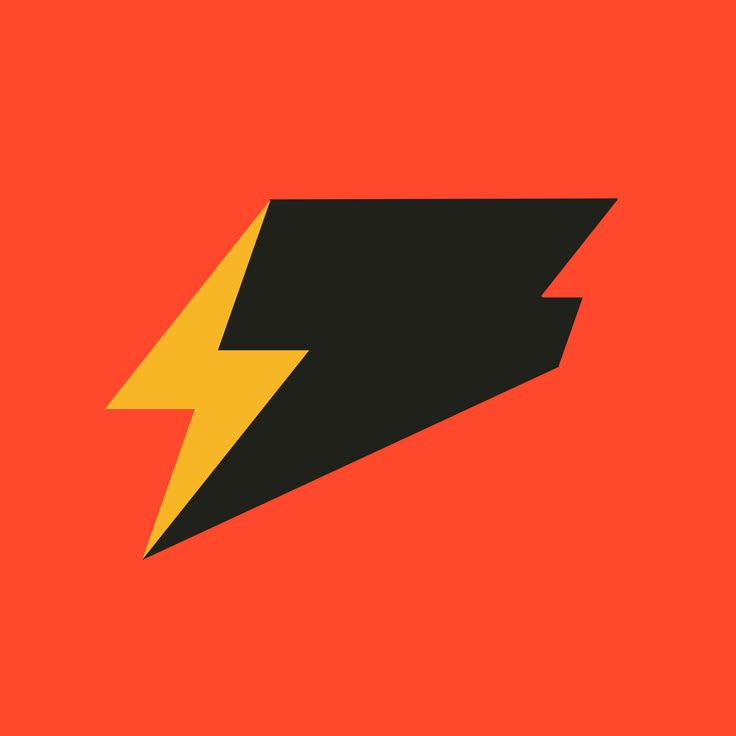

<div align="center" style="max-width:920px;margin:0 auto;">

<!-- brass spec plate — same stamped language as Bolt, tuned for docs -->
<div style="border:1.5px solid #22211e;border-radius:16px;overflow:hidden;background:#0c0c0d;line-height:0;">


<div style="display:flex;align-items:center;gap:16px;padding:16px 18px;background:#0c0c0d;text-align:left;line-height:1;">



<div style="min-width:0;flex:1 1 auto;text-align:left;">
<div style="font-family:ui-sans-serif,system-ui,-apple-system,Segoe UI,Helvetica,Arial,sans-serif;font-weight:800;font-size:22px;letter-spacing:-0.03em;color:#faf8f3;line-height:1;">bolt-docs</div>
<div style="font-family:ui-sans-serif,system-ui,sans-serif;font-weight:500;font-size:12.5px;color:#a8a9ad;line-height:1.4;margin-top:3px;">Vite + React · <span style="color:#faf8f3;">Bolt-OS</span> registry · auto-synced · MIT</div>
</div>

<div style="flex:0 0 auto;display:flex;gap:8px;align-items:center;">
<span style="font-family:ui-monospace,SFMono-Regular,Menlo,monospace;font-size:11px;font-weight:600;letter-spacing:0.04em;color:#0c0c0d;background:#f7b626;padding:7px 10px;border-radius:999px;">MIT</span>
<span style="font-family:ui-monospace,SFMono-Regular,Menlo,monospace;font-size:11px;color:#e8e8e6;border:1px solid #2a2a2a;padding:6px 10px;border-radius:999px;">vite 8 · react 19</span>
</div>

</div>
</div>

<p style="margin:14px 0 0 0;font-family:ui-monospace,SFMono-Regular,Menlo,monospace;font-size:12px;color:#6b6b6b;">
44 commands · 11 guides · synced from <a href="https://github.com/gogeta1232/Bolt-OS" style="color:#6b6b6b;text-decoration:underline;text-underline-offset:3px;text-decoration-color:#3a3a3a;">Bolt-OS</a> · live at <a href="https://boltdocs-gogeta1232s-projects.vercel.app" style="color:#6b6b6b;text-decoration:underline;text-underline-offset:3px;text-decoration-color:#3a3a3a;">boltdocs-gogeta1232s-projects.vercel.app</a>
</p>

</div>

---

<div align="center">

**One registry, never hand-edited.** `commands.json` is generated from `Bolt-OS/src/commands` and pulled nightly — docs never drift.

<p style="margin:14px 0 0 0;">
<a href="https://boltdocs-gogeta1232s-projects.vercel.app"></a>&nbsp;
<a href="https://github.com/gogeta1232/bolt-docs/actions/workflows/ci.yml"></a>&nbsp;
<a href="https://github.com/gogeta1232/Bolt-OS"></a>
</p>

</div>

### Inventory at a glance

<table>
<tr>
<td width="25%" align="center" valign="top" style="background:#0c0c0d;border:1px solid #22211e;border-top:3px solid #f7b626;border-radius:12px;padding:16px;">
<div style="font-family:ui-monospace,SFMono-Regular,Menlo,monospace;font-size:11px;letter-spacing:0.08em;color:#a8a9ad;">COMMANDS</div>
<div style="font-family:ui-sans-serif,system-ui,sans-serif;font-weight:800;font-size:28px;letter-spacing:-0.04em;color:#faf8f3;line-height:1;margin-top:6px;">44</div>
<div style="font-family:ui-sans-serif,sans-serif;font-size:12px;color:#a8a9ad;margin-top:4px;">searchable · slash + prefix</div>
</td>
<td width="25%" align="center" valign="top" style="background:#0c0c0d;border:1px solid #22211e;border-top:3px solid #f7b626;border-radius:12px;padding:16px;">
<div style="font-family:ui-monospace,SFMono-Regular,Menlo,monospace;font-size:11px;letter-spacing:0.08em;color:#a8a9ad;">GUIDES</div>
<div style="font-family:ui-sans-serif,system-ui,sans-serif;font-weight:800;font-size:28px;letter-spacing:-0.04em;color:#faf8f3;line-height:1;margin-top:6px;">11</div>
<div style="font-family:ui-sans-serif,sans-serif;font-size:12px;color:#a8a9ad;margin-top:4px;">markdown · from source</div>
</td>
<td width="25%" align="center" valign="top" style="background:#0c0c0d;border:1px solid #22211e;border-top:3px solid #f7b626;border-radius:12px;padding:16px;">
<div style="font-family:ui-monospace,SFMono-Regular,Menlo,monospace;font-size:11px;letter-spacing:0.08em;color:#a8a9ad;">SYNC</div>
<div style="font-family:ui-sans-serif,system-ui,sans-serif;font-weight:800;font-size:28px;letter-spacing:-0.04em;color:#faf8f3;line-height:1;margin-top:6px;">nightly</div>
<div style="font-family:ui-sans-serif,sans-serif;font-size:12px;color:#a8a9ad;margin-top:4px;">+ on push dispatch</div>
</td>
<td width="25%" align="center" valign="top" style="background:#0c0c0d;border:1px solid #22211e;border-top:3px solid #f7b626;border-radius:12px;padding:16px;">
<div style="font-family:ui-monospace,SFMono-Regular,Menlo,monospace;font-size:11px;letter-spacing:0.08em;color:#a8a9ad;">STACK</div>
<div style="font-family:ui-sans-serif,system-ui,sans-serif;font-weight:800;font-size:28px;letter-spacing:-0.04em;color:#faf8f3;line-height:1;margin-top:6px;">vite 8</div>
<div style="font-family:ui-sans-serif,sans-serif;font-size:12px;color:#a8a9ad;margin-top:4px;">react 19 · ts 6</div>
</td>
</tr>
</table>

> Isolated `Vite` site — no bot runtime inside. Reads `src/data/commands.json` only.

## Open it

```bash
git clone https://github.com/gogeta1232/bolt-docs.git
cd bolt-docs
npm ci
npm run dev
# http://localhost:5173
```

No secrets. Static build. Override invite or GitHub link locally:

```bash
cp .env.example .env.local
# VITE_DISCORD_INVITE_URL=https://discord.com/api/oauth2/authorize?client_id=1424440972758220800&permissions=1101017476118&scope=bot%20applications.commands
# VITE_GITHUB_URL=https://github.com/gogeta1232/Bolt-OS
npm run dev
```

## What lives here

```
src/
  components/layout/   Rail (glow) · Topbar · CommandPalette · ThemeToggle
  components/profile/  DiscordProfileCard — Add to Server via VITE_DISCORD_INVITE_URL
  components/ui/       badge · button · card · input
  features/commands/   Card · Grid · Detail · FilterBar · CopyButton
  pages/               Home · Commands · Guides · Guide · HowItWorks · NotFound
  content/             11 markdown guides
  data/                commands.json — generated, never hand-edit
  lib/                 guides · taxonomy · search · rail · theme
public/                bolt_banner.png · bolt_pfp.webp — local art, not CDN
vercel.json            CSP · HSTS · SPA fallback → /index.html
```

Hardened: no `rehypeRaw`, `ReactMarkdown` `urlTransform` blocks `javascript:`/`data:`/`vbscript:`, `rel="noopener noreferrer"` on externals, `allowedMentions` safe, CSP meta + headers.

## Sync — how it stays fresh

```
Bolt-OS  push src/commands/** ──► npm run docs:export ──► site/src/data/commands.json ──► dispatch
                                                      │
bolt-docs  ◄──────── fetch https://raw.githubusercontent.com/gogeta1232/Bolt-OS/main/site/src/data/commands.json ── nightly 03:17 UTC + on dispatch
          └─ commit if changed ──► Vercel auto-deploys main → https://boltdocs-gogeta1232s-projects.vercel.app
```

Manual:

```bash
npm run sync:commands
# or
COMMANDS_URL=https://raw.githubusercontent.com/gogeta1232/Bolt-OS/main/site/src/data/commands.json npm run sync:commands
```

## Scripts

| Command | What it does |
|---------|--------------|
| `npm run dev` | Vite dev — `localhost:5173` |
| `npm run build` | `tsc -b && vite build && copy dist/index.html → dist/404.html` |
| `npm run preview` | Preview `dist/` |
| `npm run lint` | `oxlint` |
| `npm run typecheck` | `tsc -b --noEmit` |
| `npm run format` | `prettier --write .` |
| `npm run sync:commands` | Pull `commands.json` from `Bolt-OS` |

## Deploy — Vercel free, clean domain

**Import once:** https://vercel.com/new → Add `gogeta1232/bolt-docs` → Framework `Vite` → Build `npm run build` → Output `dist` → Env `VITE_DISCORD_INVITE_URL`, `VITE_GITHUB_URL` → Deploy.

`vercel.json` already sets:

- `rewrites: /→/index.html` (SPA)
- `headers:` `Content-Security-Policy`, `X-Frame-Options: DENY`, `X-Content-Type-Options: nosniff`, `Referrer-Policy: strict-origin-when-cross-origin`, `Permissions-Policy`, `Cache-Control: immutable` for `/assets/`

No extra dashboard work — pushes to `main` deploy automatically.

## Environment

| Var | Purpose | Default |
|-----|---------|---------|
| `VITE_DISCORD_INVITE_URL` | Profile card **Add to Server** | `https://discord.com/api/oauth2/authorize?client_id=1424440972758220800&permissions=1101017476118&scope=bot%20applications.commands` |
| `VITE_GITHUB_URL` | Topbar GitHub icon | `https://github.com/gogeta1232/Bolt-OS` |
| `VITE_GITHUB_DOCS_URL` | Footer link | `https://github.com/gogeta1232/bolt-docs` |

See `.env.example`. Do not commit `.env.local`.

## Security

- Markdown never renders raw HTML — `remarkGfm` only.
- `urlTransform` allow-lists `https://`, `/`, `#`, `mailto:` → `#`.
- `vercel.json` + `index.html` CSP `default-src 'self'`; `style-src 'self' 'unsafe-inline'` for Tailwind; `img-src 'self' data: https:`; `frame-ancestors 'none'`.
- `npm audit --omit=dev --audit-level=high` in CI.

## License

MIT — [LICENSE.md](LICENSE.md).  
Bolt bot itself is [Elastic License 2.0](https://github.com/gogeta1232/Bolt-OS/blob/main/LICENSE.md) — source-available, not OSI open source.

<p align="center" style="margin-top:28px;">
<sub style="color:#6b6b6b;">bolt-docs — Vite · React · Tailwind · <a href="https://github.com/gogeta1232/Bolt-OS" style="color:#6b6b6b;">Bolt-OS</a> · MIT</sub>
</p>
